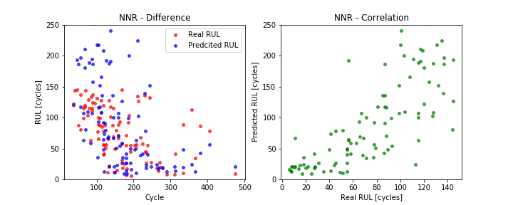
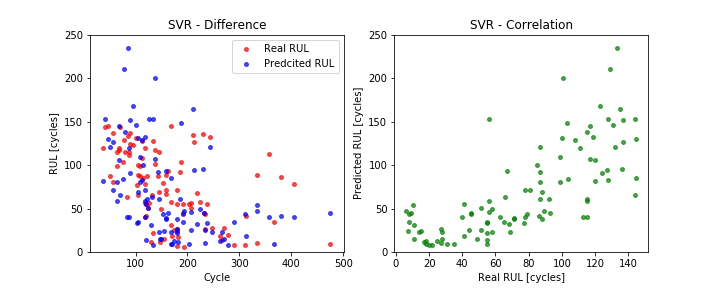
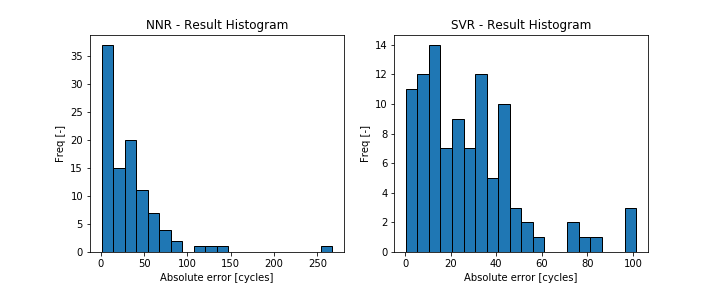

# Aircraft engine failure prediction model
I tried to predict the RUL values for the 100 trajectories in the FD003 dataset from [Turbofan Engine Degradation Simulation Data Set](https://ti.arc.nasa.gov/tech/dash/groups/pcoe/prognostic-data-repository/#turbofan) using two different models (neural network and support vector machine).
My code can be found in the `turbofan.ipynb` file.

## Data Preparation, Feature Engineering
I computed the RUL value for each row in the training dataset and simplified the model by treating each sample as an independent observations.

I used the formula (3) in [1] to normalize each feature and then selected only features with standarad deviation > 0 to incude in the prediton. The transformed training dataset contains 24720 samples and 20 features.

## Neural Network Regression
The first model is a neural network implemented using `DNNRegressor` from the TensorFlow library. After some experimenting, I decided to use a network with 3 hidden layers containing 15, 30, and 15 units.

## Support Vector Machine
Use of a Support vector machine (SVM) model is suggested in [2]. The authors recommend to use non-linear radial basis (RBF) function.
SVM model is provided in the Scikit library. I used the default setting with the RBF kernel function.

## Results
I chose three different metrics to assess the prediction for each model. Mean square error (MSE), median of absolute differences between the real and predicted RULs, and the Score in [3]. I modified the Score formula (11) in [3] by dividing the overall value by the number of testing samples.

| Metric                     | Neural Network | SVM   |
| -------------------------- |:--------------:| -----:|
| MSE                        | 5.39           | 3.54  |
| Median absolute difference | 27.86          | 22.96 |
| Score                      | 3.56e6         | 677.2 |

## Conclusions
All three metrics show the SVM as the better performing model. The large difference in the Score is caused by the neural network model "overshooting" (the predicted RUL is greater than the real value) which the Score function heavily penalizes [3].

## References
* [[1] Data driven prognostics using a Kalman filter ensemble of neural network models](http://ieeexplore.ieee.org/document/4711423/) 
* [[2] PHM-Oriented Integrated Fusion Prognostics for Aircraft Engines Based on Sensor Data](http://ieeexplore.ieee.org/document/6678166/) 
* [[3] Damage Propagation Modeling for Aircraft Engine Run-to-Failure Simulation](http://ieeexplore.ieee.org/document/4711414/) 
