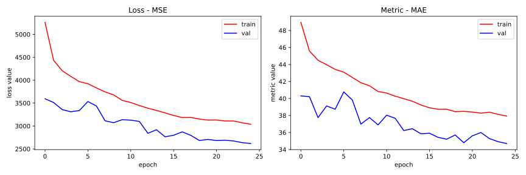
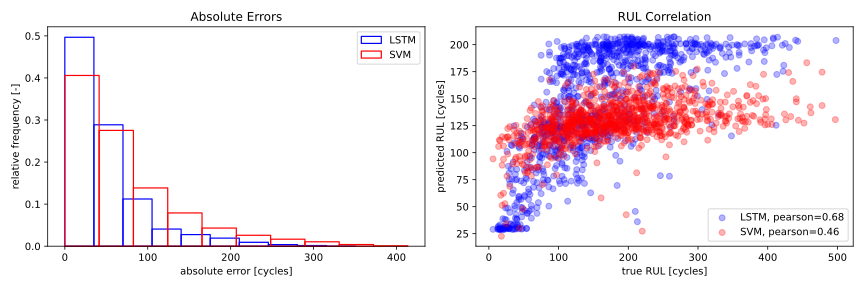

# Aircraft Engine Failure prediction Model

[0]: https://ti.arc.nasa.gov/tech/dash/groups/pcoe/prognostic-data-repository/#turbofan
[1]: https://ieeexplore.ieee.org/document/4711423/
[2]: https://ieeexplore.ieee.org/document/6678166/
[3]: https://ieeexplore.ieee.org/document/4711414/

This problem requires to accurectly predict remaining useful life (RUL) of aircraft
turbofan engines based on various sensor measurements (multivariate time series).
The RUL is defined as the number of engine cycles before failure.

I tried to predict the RUL values for engine units in the FD004 dataset from
[Turbofan Engine Degradation Simulation Data Set][0] using two different models
(LSTM network and support vector machine). My code can be found in the
`turbofan.ipynb` file.

## Data Preparation and Feature Engineering

First, I computed the RUL value for each row in the dataset to get a dataframe in the
following form:

| unit | cycle | sensor_1 | sensor_2 | sensor_n | RUL |
|------|-------|----------|----------|----------|-----|
| 1    | 1     | 0.2      | 30       | 0.9      | 192 |
| 1    | 2     | 0.3      | 29       | 0.2      | 191 |

Each row can be used as a model training sample where the `sensor_k` columns are
the features and the `RUL` is the model target. The rows are treated as independend
observations and the measurement trends from the previous cycles are ignored.

As recommended in [(1)][1], the features are normalized to `μ = 0, σ = 1`
and PCA is applied.

This simplified approach is used to train the support vector machine model.

### Samples as Time Series

For the LSTM model, I opted for more advanced feature engineering and chose to
incorporate the trends from the previous cycles. In this case, each training sample
consists of masurements at cycle `i` as well as `i-5, i-10, i-20, i-30, i-40`.

The model input is a 3D tensor with shape `(n, 6, 24)` where `n` is the number of
training samples, `6` is the number of cycles (timesteps), and `24` is the number
of principal components (features).  

## LSTM Regressor

After running random search to optimize the hyperparameters and some experimentation,
I settled on the following architecture:

```
Model: "rlu_estimator"
_________________________________________________________________
Layer (type)                 Output Shape              Param #   
=================================================================
components (InputLayer)      [(None, 6, 24)]           0         
_________________________________________________________________
lstm (LSTM)                  (None, 64)                22784     
_________________________________________________________________
dropout_lstm (Dropout)       (None, 64)                0         
_________________________________________________________________
hidden_0 (Dense)             (None, 64)                4160      
_________________________________________________________________
dropout_0 (Dropout)          (None, 64)                0         
_________________________________________________________________
hidden_1 (Dense)             (None, 64)                4160      
_________________________________________________________________
dropout_1 (Dropout)          (None, 64)                0         
_________________________________________________________________
hidden_2 (Dense)             (None, 64)                4160      
_________________________________________________________________
dropout_2 (Dropout)          (None, 64)                0         
_________________________________________________________________
rul_prediction (Dense)       (None, 1)                 65        
=================================================================
Total params: 35,329
Trainable params: 35,329
Non-trainable params: 0
```

The model is using L1L2 regularization and dropout layers to mitigate overfitting.

I trained the model 25 epochs and used annealing scheduler to decrease the
learning rate over time.



## Support Vector Machine

Use of a Support vector machine (SVM) model is suggested in [(2)][2]. The authors
recommend to use non-linear radial basis (RBF) function.

## Results

I chose three different metrics to assess the performance of the models. Mean square
error (MSE), median absolute error (MAE) and the Score as defined in [(3)][3].
I modified the Score formula (11) in [(3)][3] by dividing the overall value by the
number of testing samples (the definition in the paper contains an error, `a_1`
and `a_2` should be switched in order to penalize RUL overshooting more heavily).

| metric | LSTM    | SVM     |
|--------|---------|---------|
| MSE    | 4627    | 5894    |
| MAE    | 35      | 45      |
| Score  | 8.58e10 | 1.65e14 |



## Conclusions

It is clear that the advanced features together with the LSTM outperform the SVM model. 
The high Score values are caused by few outliers with significant errors and the exponential
nature of the formula [(3)][3].

## References
* [(1) Data driven prognostics using a Kalman filter ensemble of neural network models][1]
* [(2) PHM-Oriented Integrated Fusion Prognostics for Aircraft Engines Based on Sensor Data][2]
* [(3) Damage Propagation Modeling for Aircraft Engine Run-to-Failure Simulation][3]
